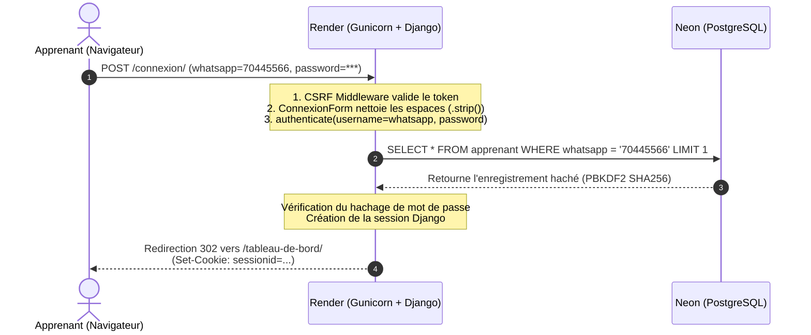

# 🌐 Architecture de Déploiement — Come To Code
> **Guide technique, conceptuel et pédagogique**  
> *Comprendre, expliquer et maîtriser l'architecture moderne Cloud (GitHub · Render · Neon PostgreSQL · Django)*

---

## 📑 Sommaire
1. [Vue d'ensemble de l'Architecture](#1-vue-densemble-de-larchitecture)
2. [Schéma Global d'Interaction (Mermaid)](#2-schéma-global-dinteraction)
3. [Les 4 Piliers de l'Architecture Développés](#3-les-4-piliers-de-larchitecture)
4. [Cycle de Vie d'un Déploiement (CI/CD Automatique)](#4-cycle-de-vie-dun-déploiement)
5. [Parcours d'une Requête Utilisateur](#5-parcours-dune-requête-utilisateur)
6. [Contraintes et Limites Réelles (Render & Neon)](#6-contraintes-et-limites-réelles-render--neon)
7. [Fiche de Soutenance : Réponses aux Questions des Professeurs](#7-fiche-de-soutenance--questions-types)
8. [Checklist pour Reproduire cette Architecture](#8-checklist-de-reproduction)

---

## 1. Vue d'ensemble de l'Architecture

Le projet **Come To Code** adopte une architecture dite **PaaS / DaaS Cloud découplée** (*Decoupled Cloud Architecture*) :

- **Le Code Source & Intégration Continue (CI) :** Hébergé sur **GitHub**.
- **Le Serveur d'Application (PaaS - *Platform as a Service*) :** Hébergé sur **Render.com** (exécute Python, Gunicorn, Whitenoise).
- **La Base de Données (DaaS - *Database as a Service*) :** Hébergée sur **Neon.tech** (PostgreSQL Serverless managé).
- **La Sécurité & Environnement :** Gestion via variables d'environnement (`DATABASE_URL`, `DJANGO_SECRET_KEY`, etc.).

### 💡 Pourquoi ce choix d'architecture ?
Contrairement à un serveur monolithique (où le code, la base de données et les fichiers sont sur une seule machine locale ou VPS non managé), cette séparation apporte :
1. **La haute disponibilité :** Si le serveur web redémarre, la base de données reste intacte et active.
2. **L'automatisation (CI/CD) :** Chaque `git push origin main` déclenche automatiquement les tests, la compilation des fichiers statiques, les migrations de base de données et la mise en production.
3. **La sécurité industrielle :** Aucune information sensible (mots de passe, clés de chiffrement) n'est écrite en clair dans le code grâce aux variables d'environnement.

---

## 2. Schéma Global d'Interaction

```mermaid
flowchart TD
    subgraph Developpeur[" 💻 Poste Développeur "]
        Code["Code Django / Python"]
        GitCommit["git commit && git push"]
        Code --> GitCommit
    end

    subgraph GitHub[" 🐙 GitHub (Dépôt Git) "]
        Repo["Repository GitHub\n(come_to_code)"]
        Webhook["Webhook de Déclenchement"]
        Repo --> Webhook
    end

    subgraph Render[" 🚀 Render.com (PaaS - Web Service) "]
        BuildHook["Phase de Build (build.sh)\n1. pip install -r requirements.txt\n2. python manage.py collectstatic\n3. python manage.py migrate\n4. python manage.py create_default_admin"]
        Gunicorn["Serveur WSGI (Gunicorn)\nMulti-workers"]
        Whitenoise["Whitenoise Middleware\n(Distribution CSS / JS / Assets)"]
        Security["Couche Sécurité SSL & CSRF"]
        BuildHook --> Gunicorn
        Gunicorn --> Whitenoise
        Gunicorn --> Security
    end

    subgraph Neon[" 🐘 Neon.tech (DaaS - PostgreSQL Serverless) "]
        PgEngine["PostgreSQL Engine"]
        ConnPool["Connection Pooler (PgBouncer)"]
        Storage["Stockage persistant NVMe"]
        ConnPool --> PgEngine
        PgEngine --> Storage
    end

    subgraph Clients[" 👥 Utilisateurs & Navigateurs "]
        Apprenant["Apprenant / Admin\n(Navigateur Web)"]
    end

    %% Flux de données
    GitCommit -->|1. Push Code| Repo
    Webhook -->|2. Notifie Déploiement| BuildHook
    Security <-->|3. Requêtes SQL Sécurisées (SSL)| ConnPool
    Apprenant <-->|4. Requêtes HTTPS| Security
```

---

## 3. Les 4 Piliers de l'Architecture

### Pilier 1 : GitHub (Le Référentiel et Déclencheur)
- **Rôle :** Centraliser l'historique du code source et servir de pont pour le déploiement continu.
- **Fonctionnement :** Dès qu'une modification est poussée sur la branche `main`, GitHub envoie un signal réseau (Webhook) à Render pour lancer la mise à jour.

### Pilier 2 : Render.com (L'Hébergeur d'Application)
- **Rôle :** Créer un conteneur Linux isolé, installer les dépendances et exécuter l'application Django 24h/24.
- **Composants clés sur Render :**
  - `build.sh` : Le script d'automatisation exécuté à chaque mise en ligne.
  - `gunicorn config.wsgi:application` : Le serveur HTTP de production rapide et robuste adapté à Python.
  - `whitenoise` : Un module Python configuré dans `settings.py` pour servir directement les fichiers statiques (CSS, JavaScript, images d'interface) sans avoir besoin d'un serveur Nginx externe.

### Pilier 3 : Neon.tech (La Base de Données Serverless)
- **Rôle :** Stocker de manière permanente toutes les données (comptes apprenants, devoirs, soumissions, sessions).
- **Spécificité technique :** Neon sépare le moteur de calcul (*Compute*) du stockage (*Storage*). Il supporte le chiffrement SSL obligatoire (`?sslmode=require`) et fournit une chaîne de connexion standard `DATABASE_URL`.

### Pilier 4 : Django & dj-database-url (L'Orchestration Applicative)
- **Rôle :** Traduire les requêtes HTTP, valider les règles métiers, interroger la base via l'ORM et générer les templates HTML Bootstrap.
- **Rôle de `dj-database-url` :** Permet à Django de lire dynamiquement la variable `DATABASE_URL` fournie par Render sans coder les accès en dur.

```python
# config/settings.py
DATABASE_URL = os.environ.get('DATABASE_URL')
if DATABASE_URL:
    DATABASES = {
        'default': dj_database_url.parse(
            DATABASE_URL,
            conn_max_age=600,
            conn_health_checks=True,
        )
    }
```

---

## 4. Cycle de Vie d'un Déploiement

Voici ce qui se passe automatiquement, seconde par seconde, quand vous lancez `git push origin main` :

```
[Étape 1] git push origin main 
          └── GitHub reçoit le nouveau code.

[Étape 2] GitHub ➔ Render (Webhook)
          └── Render clone le code dans un environnement virtuel propre.

[Étape 3] Exécution de build.sh :
          ├── 1. pip install -r requirements.txt (Installation des librairies)
          ├── 2. python manage.py collectstatic (Rassemblement des CSS/JS dans staticfiles/)
          ├── 3. python manage.py migrate (Application des tables dans PostgreSQL Neon)
          └── 4. python manage.py create_default_admin (Création sécurisée de l'admin)

[Étape 4] Démarrage de Gunicorn :
          └── gunicorn config.wsgi:application --bind 0.0.0.0:$PORT

[Étape 5] Health Check & Mise en ligne :
          └── Le site passe au statut "Live" avec certificat SSL HTTPS actif.
```

---

## 5. Parcours d'une Requête Utilisateur

### Exemple : L'utilisateur se connecte sur `/connexion/`



---

## 6. Contraintes et Limites Réelles (Render & Neon)

Dans le cadre d'un projet académique ou professionnel, il est capital de connaître les forces et les contraintes techniques du **plan gratuit** (*Free Tier*) :

| Composant | Contrainte Technique | Explication & Impact | Solution / Bonne Pratique |
| :--- | :--- | :--- | :--- |
| **Render (Web)** | **Mise en veille (*Spin-down*)** | Après **15 minutes sans visite**, le serveur web s'endort. La première requête suivante met **30 à 50 secondes** à répondre (*Cold Start*). | Normal en gratuit. Ne pas paniquer au premier chargement ; les requêtes suivantes sont instantanées. |
| **Render (Web)** | **Disque Éphémère (*Ephemeral Storage*)** | Les fichiers téléversés dans `media/` (ex: PDF de devoirs déposés par les apprenants) **disparaissent lors d'un redémarrage ou nouveau déploiement** car le disque du conteneur est réinitialisé. | Pour une production permanente : connecter un stockage d'objets externe (AWS S3, Cloudinary, ou Supabase Storage). |
| **Render (Web)** | **Limite de 750h / mois** | Le quota gratuit permet de faire tourner 1 service Web en continu 24h/24 pendant le mois. | Suffisant pour un projet d'école ou un prototype actif. |
| **Neon (BDD)** | **Mise en veille du Compute (*Auto-suspend*)** | Neon suspend son CPU après **5 minutes d'inactivité SQL**. | Au premier appel, Neon se réveille en **~500 ms** (extrêmement rapide et imperceptible). Les données ne sont **jamais perdues**. |
| **Neon (BDD)** | **SSL Obligatoire** | Neon refuse toute connexion non chiffrée. | Toujours conserver `?sslmode=require` dans l'URL de base de données. |
| **Neon (BDD)** | **Limite de connexions simultanées** | Postgres limite le nombre de connexions ouvertes simultanément. | Utiliser le **Connection Pooling** de Neon (hôte `ep-...-pooler.neon.tech`) et `conn_max_age=600` dans Django. |

---

## 7. Fiche de Soutenance : Questions Types

Lors de votre présentation devant un professeur ou un jury, voici comment argumenter vos choix :

### ❓ Question 1 : Pourquoi ne pas avoir utilisé SQLite directement sur Render ?
> **Réponse de l'étudiant :**  
> *"SQLite enregistre les données dans un simple fichier local (`db.sqlite3`). Or, sur les plateformes PaaS comme Render, le système de fichiers est éphémère. À chaque redéploiement ou redémarrage du conteneur, le fichier SQLite aurait été écrasé et toutes les données perdues. Nous avons donc opté pour **PostgreSQL managé sur Neon**, garantissant une persistance totale et conforme aux standards de l'industrie."*

---

### ❓ Question 2 : Comment garantissez-vous la sécurité des mots de passe et des secrets ?
> **Réponse de l'étudiant :**  
> *"Nous appliquons le principe du **12-Factor App** :  
> 1. Les variables sensibles (`DATABASE_URL`, `DJANGO_SECRET_KEY`) ne sont jamais écrites en clair dans GitHub ; elles sont injectées dynamiquement par le tableau de bord Render.  
> 2. Les mots de passe des apprenants et administrateurs sont hachés avec l'algorithme robuste **PBKDF2 SHA-256** avec sel cryptographique. Même avec un accès direct à la base de données, les mots de passe ne sont pas lisibles en clair.  
> 3. Toutes les communications entre le navigateur, Render et Neon sont chiffrées de bout en bout via **HTTPS et SSL/TLS**."*

---

### ❓ Question 3 : Comment avez-vous résolu l'erreur d'identifiants incorrects après le premier déploiement ?
> **Réponse de l'étudiant :**  
> *"La base distante Neon étant initialement vierge de tout utilisateur, les comptes créés en local sur notre machine n'y existaient pas. De plus, Django utilise le numéro WhatsApp comme identifiant (`USERNAME_FIELD = 'whatsapp'`).  
> Pour fiabiliser le système, nous avons :  
> 1. Intégré l'exécution d'une commande d'initialisation automatique (`python manage.py create_default_admin`) directement dans le pipeline de compilation `build.sh`.  
> 2. Sécurisé la saisie avec un nettoyage automatique des espaces (`.strip()`) dans les formulaires d'authentification."*

---

## 8. Checklist de Reproduction

Pour reproduire cette architecture sur n'importe quel projet Django :

1. **Créer la base sur Neon :**
   - Créer un projet sur [Neon.tech](https://neon.tech), copier la chaîne `postgresql://...` avec `sslmode=require`.
2. **Configurer Django :**
   - Installer `dj-database-url`, `psycopg2-binary`, `whitenoise`, `gunicorn`.
   - Ajouter `whitenoise.middleware.WhiteNoiseMiddleware` juste après `SecurityMiddleware`.
   - Configurer `STATIC_ROOT = BASE_DIR / 'staticfiles'`.
3. **Créer le script `build.sh` :**
   ```bash
   #!/usr/bin/env bash
   set -o errexit
   pip install -r requirements.txt
   python manage.py collectstatic --no-input
   python manage.py migrate
   python manage.py create_default_admin
   ```
4. **Déployer sur Render :**
   - Créer un **Web Service**, lier le dépôt GitHub.
   - **Build Command :** `./build.sh`
   - **Start Command :** `gunicorn config.wsgi:application`
   - **Environment Variables :** Ajouter `DATABASE_URL`, `DJANGO_SECRET_KEY`, `DJANGO_DEBUG=False`.
